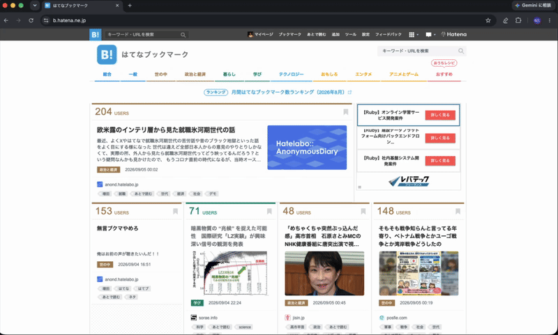

# Overview
"Furigana-kun" is a Chrome extension that adds furigana to Japanese web pages.

## What is Furigana?
Furigana is small Japanese text written above or next to kanji to show you how to read and pronounce it.

For example, the kanji **日本** can have **にほん** (nihon) written above it as furigana.

Furigana is especially helpful for Japanese learners because it makes unfamiliar kanji easier to read.

# Operation Overview

## Libraries Used

This extension uses the following open-source library:

| Library                                        | Purpose                                                     | License |
| ---------------------------------------------- | ----------------------------------------------------------- | ------- |
| [Kagome v2](https://github.com/ikawaha/kagome) | Japanese morphological analysis and word reading extraction | MIT     |

Special thanks to the developers and contributors of Kagome.
